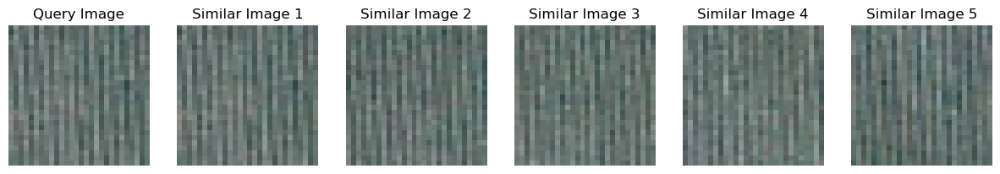
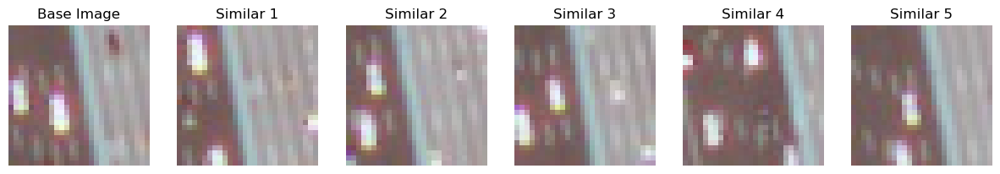
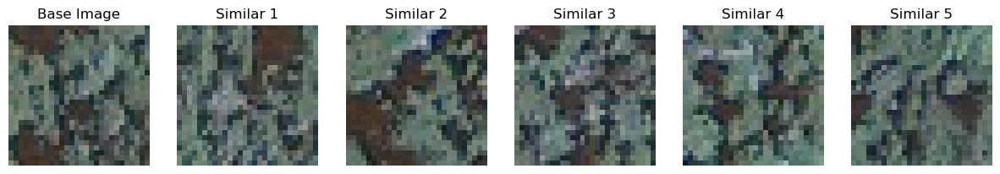
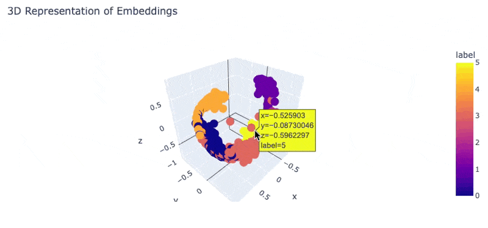
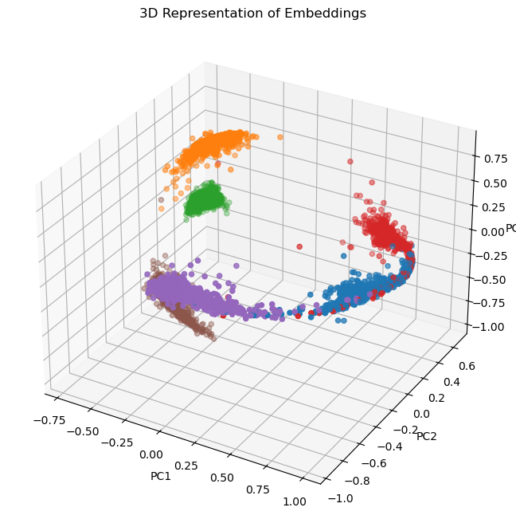

# Image Similarity Tool for Geological Images

### About
This project was used as a honors project in my Geology class. I wanted to learn more about image embeddings and vector search. This project demonstrates a workflow for creating and using a machine learning model to find similar geological images. Given an input image, the model retrieves the top K similar images from a dataset.

## Technical Highlights

- **Model** 
    - The embedding model uses a custom convolutional neural network (CNN) architecture to extract features from the images. 
    - It implements a triplet loss function to learn to make the embeddings of similar images are close together and embeddings of dissimilar images are far apart.
- **Vector Storage**
    - The embeddings are stored in a vector database using the FAISS library efficient vector similarity search. 
    - This approach allows for quick retrieval of the top K similar images given any query image from the ~30k images available.

## Results
### Here are a few examples of the model finding the top 5 similar images for a given query image

You can see the image that was that was uses as the query image on the left and the top 5 similar images on the right. It did a really good job at find similar images and patterns in the images. Its impressive that it is able to find such good results almost instantly when searching from 30k images.

### Look in to the embeddings

This example help you visualizes the embeddings of the images in 3D space. In reality the embeddings are in 128 dimensions but we can use dimensionality reduction techniques like PCA or t-SNE to visualize them in 3D space. You can see that similar images are close together and it is able to go more in-depth then just the class of rock it looks at the features of it.

### Acknowledgement
This project is from a data set of kaggle [Geological Image Similarity](https://www.kaggle.com/datasets/tanyadayanand/geological-image-similarity)
